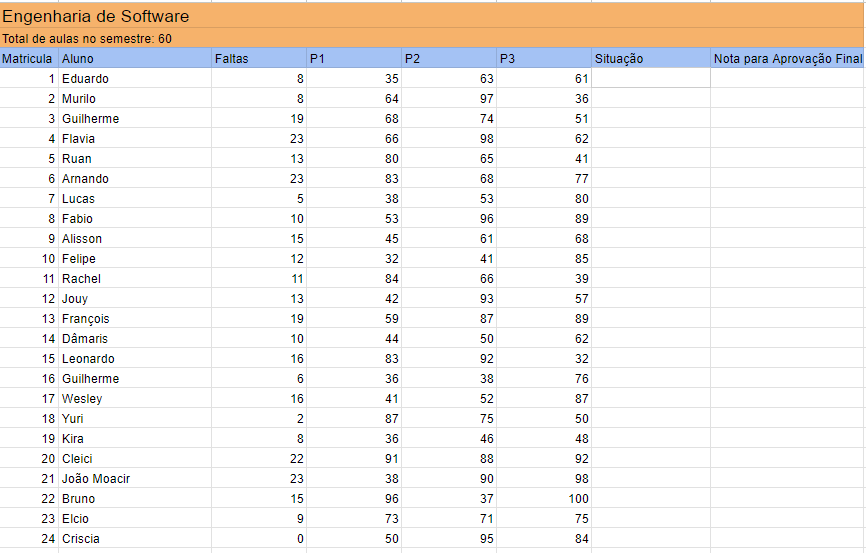

<h1 align="center"> Challenge Tunts.Rocks 2024 </h1>

This is a project for read and update one spreadsheet the Google

  <a href="#-tecnologias">Technologies</a>&nbsp;&nbsp;&nbsp;|&nbsp;&nbsp;&nbsp;
  <a href="#-projeto">About project</a>&nbsp;&nbsp;&nbsp;|&nbsp;&nbsp;&nbsp;
  <a href="#-layout">Documentation</a>&nbsp;&nbsp;&nbsp;|&nbsp;&nbsp;&nbsp;
  <a href="#memo-licença">Licence</a>

 

## 🚀 Technologies

This project was developed with the following technologies

- Python
   - gspread
   - pandas
   - numpy
   - math
- Git and Github
- Visual Studio Code

## 💻 About project

The application is used to read a Google Sheets spreadsheet, search for information, calculate and read the result in the spreadsheet.
 

[Click here](https://docs.google.com/spreadsheets/d/1Byk9WC8dvJYod1OAX5LYZh9zasOyeP_RWGAXf09-qHQ/edit#gid=0) to view Google Sheets spreadsheet.

## 📖 Documentation
To be able to complete this project, you will need to follow a step-by-step guide. 
app.py is file central and framewok.py file is the functions.
  
<h2>FIRST STEP ✔</h2>

- Log in or register on [Google Console](https://console.cloud.google.com/);
- Click in 'APIs and Services';
- In the APIs library, search for 'Google Sheets API' and activate;
- In the credentials, create 'service accounts'. Choose your name and write about your description;
- Click on the created email and copy. Go to the spreadsheet, click share, enter this copied email and send the share. (it is a bot to manipulate the spreadsheet).
- Finally, go back to the Google Console in the created service, create and download the json key from the service account, change the name to key.json, and add the file to the project folder.

<i>OBS:For security reasons, I recommend that everyone have their own Google Sheets API to use the application, which is why I added mine to gitignore.</i>
 
<h2>SECOND STEP ✔</h2>

- Download this [repository](https://github.com/CleoLeal/ChallengeTunts.Rocks);
- Install the imported libraries;
    - [pip install pandas](https://pypi.org/project/pandas/);
    - [pip install gspread](https://pypi.org/project/gspread/);
    - [pip install numpy](https://pypi.org/project/numpy/);
    - [pip install math](https://pypi.org/project/python-math/).
- Confirm that the key.json file is in the folder;
- If everything is correct, you can run the app.py file using <b>F5</b> (in Visual Studio Code) or writing <b>python app.py</b> in the console.

<h2>THIRD STEP ✔</h2>

- In the console is possible to view the results from the program (logs);
- After the console shows 'Application terminated', you can view the result in the [Google Sheets spreadsheet](https://docs.google.com/spreadsheets/d/1Byk9WC8dvJYod1OAX5LYZh9zasOyeP_RWGAXf09-qHQ/edit#gid=0).

  

## Licence

This project is under the MIT license.

  

